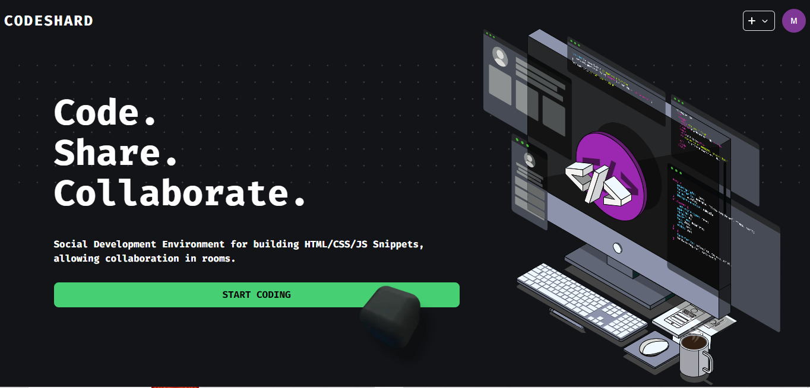
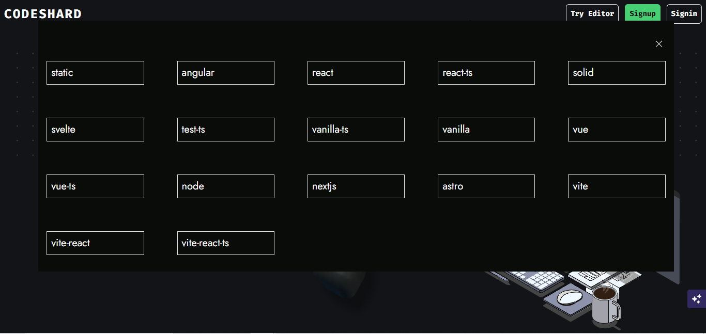
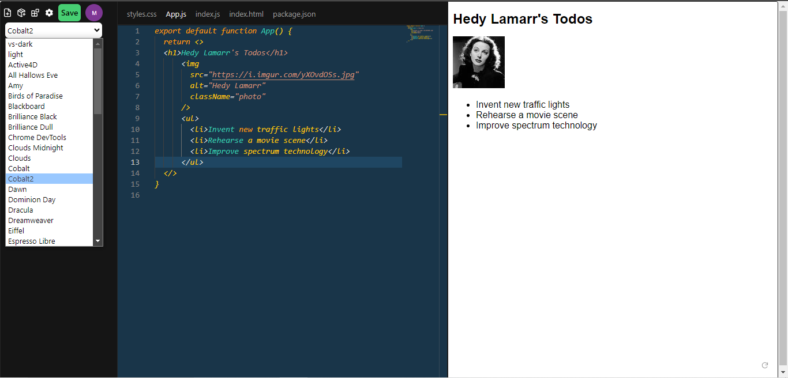
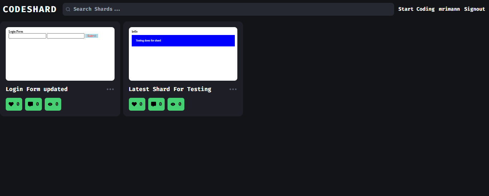
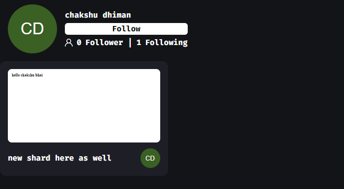
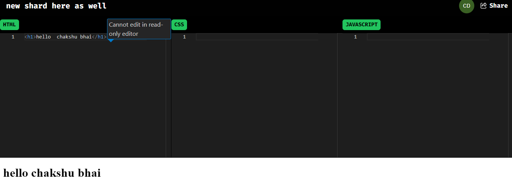
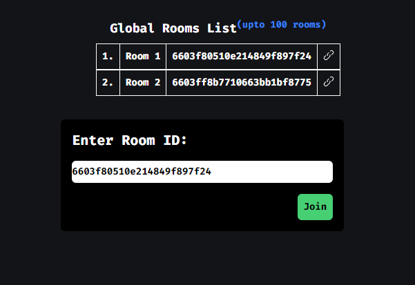
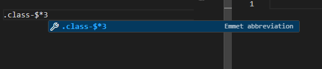
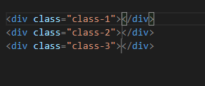

# 
CodeShard: Collaborative Code Editor for creating frontend Snippets 

## 🚀 Features:
- Signup/Login 
- Create new Shard

- View/Update/Delete Shards on Profile.

- Collaborate by creating room and sharing the room link with users.
- Change Visibility of Shards
- Try Editor feature (code will get saved locally) (without signup)
- User cannot leave without saving, if shard content altered.
- Follow/Unfollow User

- Read Only Shards for Guest Users

- Join Rooms from Room List

- Emmet abbreviation support for Editors

